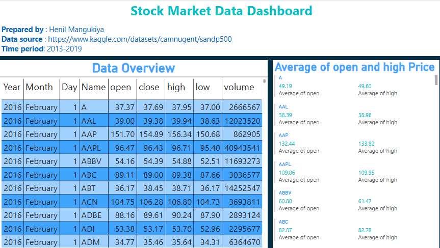
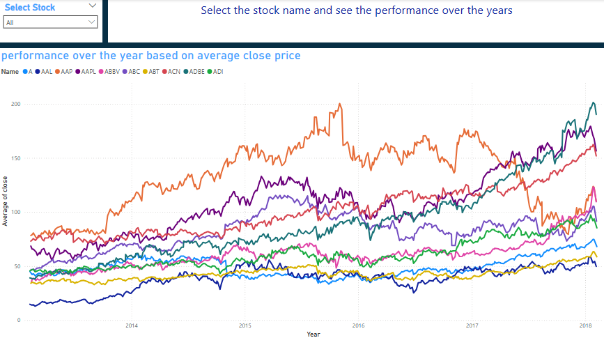
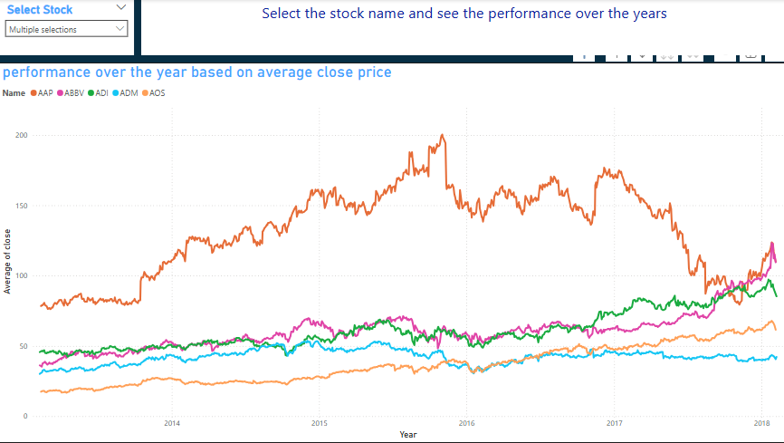
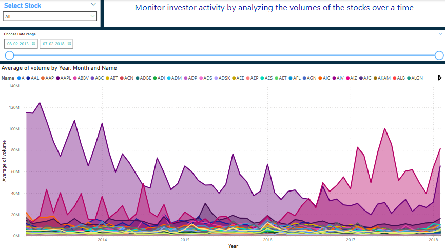
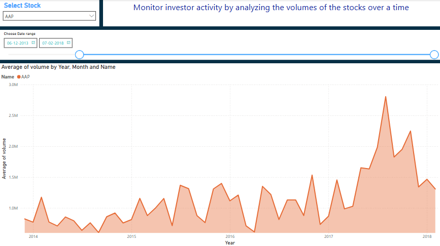
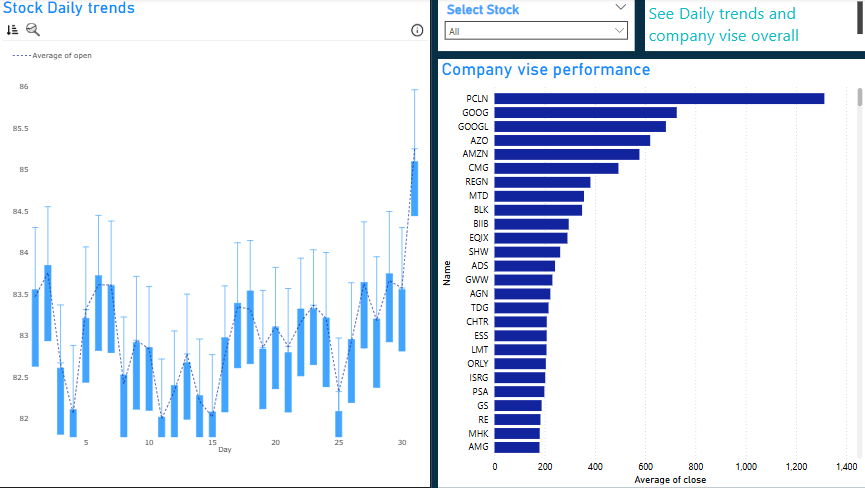
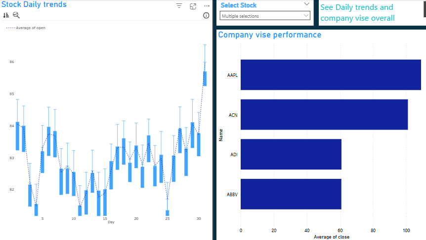
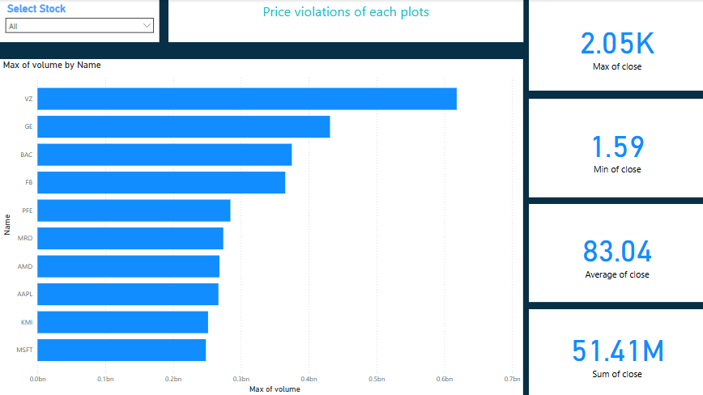

# 📊 Stock Data Analysis Dashboard (Power BI)

This project is a **Power BI dashboard** focused on analyzing and visualizing stock market data. It provides interactive insights into price trends, volumes, performance comparisons, and price violations.

## 🔍 Key Features

- Real-time stock price trend tracking
- Company & sector-wise performance overview
- Volume analysis and alerts
- Time-based movement with interactive filters
- Price violation analysis and forecasting

---

## 📷 Dashboard Screenshots

### 🧭 1. Overall Dashboard Overview

---

### 📊 2. Performance Overview
#### 📌 PO1 - Sector Performance

#### 📌 PO2 - Individual Stock Performance

---

### 📈 3. Volume Overview
#### 📌 VO1 - Volume Analysis by Stock

#### 📌 VO2 - Volume Trends Over Time

---

### 📉 4. Stock Trends
#### 📌 ST1 - Price Trends with Moving Averages

#### 📌 ST2 - Comparative Stock Movements

---

### 🚨 5. Price Violations
#### 📌 PV1 - Sudden Spikes or Drops in Price

---

## 🧰 Tech Stack

- **Power BI Desktop**
- **CSV / Excel** as data source
- **Stock Market API** (e.g., [Finnhub](https://finnhub.io), [Alpha Vantage](https://www.alphavantage.co))

---

## 🚀 How to Use

1. Clone this repository
2. Open the `.pbix` file in Power BI Desktop
3. Connect to your local or online stock dataset
4. Refresh visuals to update data

---

